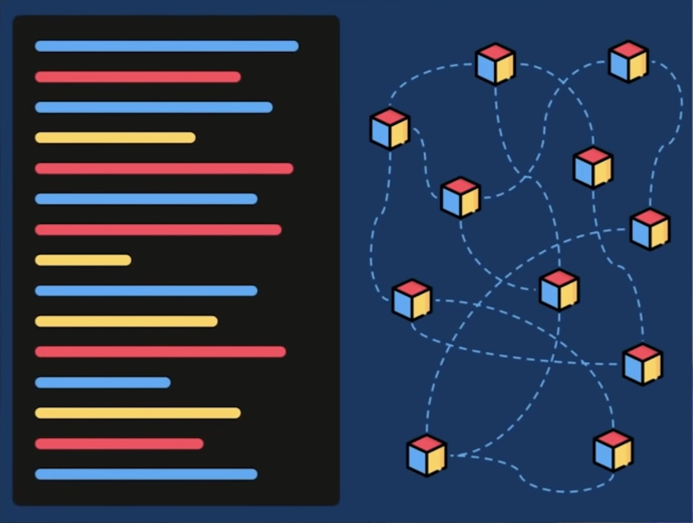

#### *Ejercicio realizado por **Alla Haruty** para el curso FullStack de DevCamp. <br>15 de abril de 2024*


# CONCEPTOS BÁSICOS DE [JavaScript](https://es.wikipedia.org/wiki/JavaScript)

### Con esta documentación aprenderemos algunos de los conceptos más importantes de JavaScript, respondiendo a las siguientes preguntas:

1. ¿Qué tipo de bucles hay en JS?

2. ¿Cuáles son las diferencias entre const, let y var?

3. ¿Qué es una función de flecha?

4. ¿Qué es la deconstrucción de variables?

5. ¿Qué hace el operador de extensión en JS?

6. ¿Qué es la programación orientada a objetos?

7. ¿Qué es una promesa en JS?

8. ¿Qué hacen async y await por nosotros?

#### Empecemos !

<span style="color:violet">1. ¿Qué tipo de bucles hay en JS?</span>

#### Los bucles en Java Script ofrecen una forma rápida y concisa de llevar a acabo una misma acción de forma repetida. Los bucles que existen tienen diferentes formas de declarar nuestras condiciones y dependiendo de cual usemos se ejecutarán de una forma u otra. <br> A continuación vamos a explicar y poner ejemplos con cada uno de los tipos de bucles existentes y vamos a ver la diferencia en sus sintáxis.

1. Bucle `for`: un bucle for se repite hasta que una condición especificada se evalúe como falsa. <br>
Se utiliza para iterar sobre una secuencia de elementos, como un arreglo o un array. Se compone de tres partes: la inicialización, la condición de continuación y la expresión de incremento o decremento y su sintaxis es la siguiente:
    ```javascript
    for ([expresiónInicial]; [expresiónCondicional]; [expresiónDeActualización])
        instrucción
    ```

    ```javascript
    let i; // declaramos una variable llamada i

    for (i = 0; i <= 5; i++) { // inicializamos i en 0, y mientras sea menor o igual que 5, vamos a iterar
        console.log(i); // imprimimos la i antes de cada iteración
    }

    output: 0 1 2 3 4 5
    ```

    > En nuestro ejemplo, el bucle for nos devolvería todos los números empezados del 0 hasta el 5 incluído, la sintaxis see leería algo así como: i es igual a 0, y mientras i sea igual o menor que 5, imprime i en la consola y luego incrementa i en 1.

2. Bucle `while`: se ejecuta mientras una condición especificada es verdadera. Es importante asegurarse de que la condición cambie en algún momento para evitar un bucle infinito.
    ```javascript
    while (condición)
        expresión
    ```

    ```javascript
    const my_numbers = [12, -3, 18, 30, -89]; // creamos nuestro array

    let i = 0; // creamos una variable que nos va a servir para iterar sobre nuestro array
    while (i < my_numbers.length) { // mientras el iterador sea menor que el largo de nuestro array
        let number = my_numbers[i]; // nuestra variable number va a contener el valor de dicho index 
            console.log(number); // imprimimos el valor de nuestra variable number
        i++; // iteramos
    }

    output: 12 -3 18 30 -89
    ```
    > En este caso, el bucle while iterará sobre nuestro y array nos devolvería todos los números que están dentro de la misma. Esto se debe a que creamos una variable llamada i que va a ser nuestro iterador sobre el array, a la que le damos el valor de 0, y con el bucle while, decimos que cuando esta variable i sea menor que el largo de nuestro array, nuestra variable llamada number va a ser igual al número que esté en el index i de nuestro array, y que nos imprima dicho number. Y así sucesivamente, hasta llegar al último index y salir del bucle.

    Podemos hacer nuestro bucle un poco más dificil, introduciendo un condicional if y solicitando que nos imprima sólo los números positivos. El código sería el siguiente: 

    ```javascript
    const my_numbers = [12, -3, 18, 30, -89]; // creamos nuestro array

    let i = 0; // creamos una variable que nos va a servir para iterar sobre nuestro array
    while (i < my_numbers.length) { // mientras i sea menor que el largo de nuestro array
        let number = my_numbers[i]; // la variable number va a ser igual al número que está en dicho index
        if (number > 0) { // si el valor actual de number es mayor que 0
            console.log(number); // imprimiremos number, sino iteraremos
        } 
        i++; // iteramos
    }

    output: 12 18 30
    ```

    > Con este bucle en conjunto con el condicional if, recorreríamos el array como en el anterior caso, pero sólo imprimiríamos los números que sean positivos, es decir mayores que 0.

3. Bucle `do...while`: La instrucción do...while se repite hasta que una condición especificada se evalúe como falsa. Su sintaxis es la siguiente:

    ```javascript
    do {
        expresión
    }
    while (condición);
    ```

    ```javascript
    let contador = 0; // creamos una variable que es igual a 0

    do { 
        console.log("El contador es: " + contador); // imprimimos el string, sólo ejecutaremos esta línea de código si la condición se cumple, 
        contador++; // aumentamos el contador
    } while (contador < 5); // si la variable contador es menor que 5, ejecutaremos el código de la linea anterior

    output: 

    El contador es: 0
    El contador es: 1
    El contador es: 2
    El contador es: 3
    El contador es: 4
    ```

    > En este ejemplo, creamos una variable llamada contador que inicializamos en 0, y con el bucle do while, le decimos que imprima el string y que itere, mientras que dicho contador sea menor que 5. 

    <span style="color:red">¡Atención! Como hemos dicho anteriormente, hay que tener especial cuidado con los bucles while y do while, para no caer en un bucle infinito. Vamos a poner un ejemplo de un bucle do while infinito para saber cómo distinguirlos.</span>

    ```javascript
    let color = "roja";

    do {
        console.log('La camiseta es roja');
    } while (color === "roja");
    ```
    > Este bucle sería infinito, ya que antes de entrar al bucle, a nuestra variable color le damos el valor de 'roja', por lo que nuestra variable siempre va a ser roja y el bucle nunca se va a volver falso y va a ser un bucle infinito.

    Vamos a poner 2 ejemplos de como podríamos solucionar un bucle do while infinito.

    Ejemplo 1:

    ```javascript
    vvar color; // creamos una variable pero no le damos valor
    do { 
        color = prompt("¿La camiseta es roja?",""); // Sólo saldremos de la ventana de alerta cuando escribamos no
    } while (color === "No"); // esta línea de codigo quiere decir, que la ventana de alerta esté activa siempre que se escriba No, y cuando se escriba Si, saldremos de la ventana
    ```
    > En este caso, utilizando prompt podemos darle a 'color' el valor que queramos, y saldrá de la ventana de alerta sólo cuando respondamos a la pregunta ¿La camiseta es roja? con la palabra Si .

    Ejemplo 2:

    ```javascript
    let color = "roja"; // creamos una variable y le damos el valor 'roja'

    do {
        console.log('La camiseta es roja'); 
        color = "la camiseta ya no es roja"; // Cambiar el valor de color para que la condición eventualmente se vuelva falsa
    } while (color === "roja"); // si el valor de color es 'roja' nos imprimirá el string 'La camiseta es roja' y le daremos un nuevo valor a color , que ya no será igual a 'roja' y así conseguiremos salir del bucle
    ```
    > En este ejemplo, aunque hemos inicializado nuestra variable color en roja, después de entrar al bucle e imprimir el string 'La camiseta es roja', le damos un nuevo valor a la variable color, que ahora es 'la camiseta ya no es roja', y así salimos del bucle ya que el bucle no se vuelve a repetir porque no se cumple la condición.

4. Bucle `for...in`: este tipo de bucles se utilizan para iterar sobre las propiedades enumerables de un objeto. Este bucle recorre todas las propiedades de un objeto y permite acceder a sus valores. Su sintaxis es la siguiente:

    ```javascript
    for (variable in objeto) {
        instrucción
    }
    ```

    ```javascript
    const mis_notas = { // creamos un objeto que contiene 3 pares de clave-valor
        matematicas: 8,
        inglés: 7,
        fisica: 10
    };

    let nota_media = 0; // creamos variable, iniciandolo en 0, donde vamos a ir guardando la suma de las notas
    let total_asignaturas = Object.keys(mis_notas).length; // averiguamos el largo del objeto, para hacer la media de las notas

    for (const asignatura in mis_notas) { // iteramos sobre cada par de key-value de nuestro objeto
        nota_media = nota_media + mis_notas[asignatura]; // vamos guardando el valor que tiene cada clave llamado asignatura
    }

    let mi_nota_final = (nota_media / total_asignaturas).toFixed(2); // hacemos la media de las notas y lo redondeamos el número a 2 decimales

    console.log(mi_nota_final); // imprimimos la nota final

    output: 8.33
    ```

    > En este ejemplo, usamos el bucle for in para acceder a los valores de cada clave y poder hacer la media de todas las notas. 

5. Bucle `for...of`: el bucle for of en JavaScript se utiliza para iterar sobre elementos iterables, como arrays, objetos iterables, cadenas de texto, y más recientemente, objetos con la propiedad. Su sintaxis es la sguiente:
    ```javascript
    for (variable of objeto)
        expresión
    ```
    Donde variable es una variable que toma el valor del elemento actual en cada iteración, e iterable es el objeto sobre el cual estamos iterando, es decir el array, una cadena de texto, etc...

    ```javascript
    const numeros = [1, 2, 3, 4, 5]; // creamos una array

    for (const numero of numeros) { // con el bucle for of, iteramos sobre nuestro array 
        console.log(numero); // y devolvemos cada número que se está guardando en la variable numero
    }

    output: 1 2 3 4 5
    ```
    > En nuestro ejemplo, iteramos sobre nuestro array, y vamos devolviendo los números de uno en uno.

    <span style="color:red">¡Atención! Los bucles for...in y for...of pueden parecer muy similares pero tienen grandes diferencias que los hacen más comprensibles. Vamos a ver sus diferencias:</span>

    | Característica       | `for...in`          | `for...of`                           |
    |----------------------|---------------------------------------------------------|--------------------------------------------------|
    | **Propósito**        | Iterar sobre las claves de un objeto.  | Iterar sobre los valores de objetos iterables.   |
    | **Funciona con**     | Objetos (incluidas propiedades heredadas).              | Arrays, strings, Mapas, Conjuntos, etc.          |
    | **Itera sobre**      | Claves del objeto (nombres de las propiedades).         | Valores de la colección.                         |
    | **Uso típico**       | Acceder a las propiedades y sus valores en un objeto.   | Procesar elementos de una estructura de datos.   |
    | **Sintaxis**          | `for (const key in objeto) { console.log(key); }`       | `for (const valor of iterable) { console.log(valor); }` |
    | **Consideraciones**  | Puede incluir propiedades heredadas del prototipo.      | Requiere que el objeto tenga un método `[Symbol.iterator]`. |

    Vamos a poner un ejemplo usando el mismo array sobre el que iterar, para ver lo que nos devolvería cada bucle.

    ```javascript
    const array = ['a', 'b', 'c']; // creamos un array

    console.log("Usando for...in:");
    for (const index in array) { // con bucle for..in iteramos sobre ella
        console.log(`Índice: ${index}, Valor: ${array[index]}`); // imprimimos las claves y valores
    }

    console.log("Usando for...of:");
    for (const value of array) { // con bucle for...of iteramos sobre ella
        console.log(`Valor: ${value}`); // imprimos los valores accedidos
    }
    ```
    > El output de nuestro código sería la siquiente, vemos que for..in devuelve la clave, en nuestro caso sus indices, y su valor, y el for...of nos devuelve sólo los valores.

    ```javascript
    Usando for...in:
    Índice: 0, Valor: a
    Índice: 1, Valor: b
    Índice: 2, Valor: c

    Usando for...of:
    Valor: a
    Valor: b
    Valor: c
    ```
<span style="color:violet">¿Cuáles son las diferencias entre let, var y const?</span>

#### En Java Script existen 3 tipos de variables y son: const, let y var. Sus diferencias son:

* `let`: let es una variable que sólo está disponible en el bloque donde se ha declarado, y no se puede acceder a ella fuera de su bloque.

* `var`: var es una variable más global, es decir se puede acceder a ella en cualquier momento del código. Su contenido es variable y se puede modificar en cualquier momento.

* `const`: const es una variable global al igual que var, pero como especifica su propio nombre, su contenido no se puede modificar.


<span style="color:violet">¿Qué es una función de flecha?</span>


#### Una función flecha, llamado arrow en inglés, es una alternativa a las funciones clásicas de JavaScript. Su sintaxis es más simple, corta y más fácil de usar, aunque no se puede implementar en cualquier situación debido a sus características.

Como bien sabemos una función clásica de JavaScript se declara con la palabra reservada `function` seguida del nombre de nuestra función, después dentro de las paréntesis la variable si es que la tenemos y en la siguiente línea, dentro de llaves, lo que queremos que realice nuestra función... Veamos un ejemplo práctico:
```javascript
function mi_saludo(nombre) { // declaramos una función llamada mi_saludo, que va a necesitar un parámetro
    return 'Hola ' + nombre; // nuestra función devolverá el string 'Hola', seguido del nombre que pasemos como parámetro
}

console.log(mi_saludo('Mikaela')); // llamamos e imprimimos nuestra función con el parámetro 'Mikaela';

output: Hola Mikaela
```

> Esta función clásica nos devolvería un saludo con el nombre que hayamos pasado como parámetro. 

Bien, veamos ahora la sintaxis de una función flecha/arrow y cómo se puede simplificar dicho código.

```javascript
let mi_saludo2 = (nombre) => { 
    return 'Hola ' + nombre;
}

console.log(mi_saludo2('Mika'));

output: Hola Mika
```
Una función flecha no depende de la palabra reservada `function`como las funciones clásicas y se dice que es anónima, lo que significa que no tiene su propio nombre sino que es almacenado dentro de una variable, en nuestro ejemplo, almacenamos nuestra función arrow en una variable llamada mi_saludo2.

Una de las características de este tipo de funciones y que las distinguen de otras, es su sintaxis que consta:

* Paréntesis () : donde vamos a ingresar nuestros parámetros en caso de tenerlos y si no los tenemos deben estar vacíos de forma obligatoria. 
* La flecha => : que es lo que nos hace entender que es una función flecha.
* Llaves {} : que es donde ingresaremos los pasos que queremos que de nuestra función.

Veámoslo en unos ejemplos claros:

```javascript
Función flecha con parámetros

let mi_variable = (mi_parámetro) => {
    return 'Los pasos que va a dar nuestra función'
}
```
```javascript
Función flecha sin parámetros

let mi_variable = () => {
    return 'Los pasos que va a dar nuestra función'
}
```

La facilidad que nos dan este tipo de funciones es que se pueden simplificar. Por ejemplo:
* Si sólo tenemos 1 parámetro, podemos omitir los paréntesis. 
* La palabra reservada return tampoco es necesario, por lo que podemos obviarla.
* Si la función tiene sólo 1 línea de código que ejecutar, podemos omitir las llaves.

```javascript
Función flecha con 1 parámetro

let mi_saludo = nombre => 'Hola ' + nombre; 
console.log(mi_saludo('Mika')); // llamamos a nuestra función con el parámetro que queramos y lo imprimimos

output: Hola Mika
```
**Resumiendo:**

* Una función flecha es una función anónima.
* No necesita la palabra reservada function ni return.
* Permite optimizar y simplificar nuestro código.


<span style="color:violet">¿Qué es la deconstrucción de variables?</span>

#### La deconstrucción de variables es una expresión de JavaScript que nos permite acceder y desempacar valores de arreglos o objetos en variables distintas. Es una manera sencilla de poder acceder a los elementos de arrays o objetos.

Vamos a ver dos ejemplos y ver cómo se puede usar la deconstrucción de variables.

```javascript
Ejemplo con un array

let mis_usuarios = ['Jorge', 'Maria', 'Leire']; // partiendo de este array

const [usuario1, usuario2, usuario3] = mis_usuarios; // usamos la deconstrucción de variables, para guardar nuestros valores del array en nuevas variables de forma individual. Y ahora podemos utilizarlos y manejarlos como queramos. Por ejemplo podemos imprimirlos usando console.log 👇

console.log(usuario1);
console.log(usuario2);
console.log(usuario3);

output: Jorge Maria Leire
```

```javascript
Ejemplo con objetos

let mis_notas = {
    matematicas: 7,
    ingles: 9,
    fisica: 8
};

const { matematicas, ingles, fisica } = mis_notas; // usamos la deconstrucción de variables para poder acceder a cada una de las asignaturas y sus notas

console.log('La nota de matemáticas es: ' + matematicas);
console.log('La nota de inglés es: ' + ingles);
console.log('La nota de física es: ' + fisica);

output:
La nota de matemáticas es: 7
La nota de inglés es: 9
La nota de física es: 8
```
```javascript
Ejemplo de cómo acceder a los variables usando templates

let mis_notas = {
    matematicas: 7,
    ingles: 9,
    fisica: 8
};

const { matematicas, ingles, fisica } = mis_notas; // usamos la deconstrucción de variables para poder acceder a cada una de las asignaturas y sus notas

console.log(`La nota de matemáticas es: ${matematicas}`); // usamos templates para imprimir
console.log(`La nota de inglés es: ${ingles}`); // usamos templates para imprimir
console.log(`La nota de física es: ${fisica}`); // usamos templates para imprimir

output:
La nota de matemáticas es: 7
La nota de inglés es: 9
La nota de física es: 8
```

Si bien es cierto que podríamos acceder a las variables del objeto llamando a mis_notas y la asignatura deseada, por ejemplo `mis_notas.matematicas`, sabemos que usando la deconstrucción de variables agilizamos el trabajo y sólo declarándolo una vez, podemos acceder a dichas variables/asignaturas siempre que queramos sin tener que repetir el mismo código `mis_notas.matematicas` repetidamente. 

Ventajas del uso de deconstrucción de variables:

1. Legibilidad del código: conseguimos un código más limpio y fácile de leer y entender. 
2. Menos verbosidad: reducimos la repetición de código, en nuestro ejemplo conseguimos reducir el código `mis_notas` cada vez que queramos acceder a una de las asignaturas.
3. Facilidad para renombrar variables: la decontrucción de variables nos permite renombrar las propiedades mientras accedemos a ellas, por ejemplo:
    ```javascript
    const { matematicas: notaFinalMatematicas, ingles: notaFinalIngles, fisica: notaFinalFisica } = mis_notas;
    ```
4. Evitamos errores: como hemos dicho anteriormente, llamar a `mis_notas.matematicas` sería más dificil y nos tomaría más tiempo que `matematicas` por lo que tendríamos más probabilidades de hacer un fallo tipográfico que nos llevaría a errores en nuestro código.

[➡️Puedes leer más información haciendo click aquí...⬅️](https://developer.mozilla.org/es/docs/Web/JavaScript/Reference/Operators/Destructuring_assignment)

<span style="color:violet">¿Qué hace el operador de extensión en JS?</span>

#### El operador de extensión, spread operator en inglés con síntaxis `(...word)`, sirve para diferentes situaciones:

1. Combinar arrays: por ejemplo si tenemos 2 arrays que queramos juntar. Vamos a verlo en un ejemplo.
    ```javascript
    const alumnos = ['Juan', 'Miguel', 'María']; // nuestro array 1
    const profesores = ['Karen', 'Eva']; // nuestro array 2

    let todasLasPersonas = [...alumnos, ...profesores]; // creamos un nuevo array que contenga nuestros 2 arrays anteriores

    console.log(todasLasPersonas); // imprimimos nuestro nuevo arry

    output: (5) ['Juan', 'Miguel', 'María', 'Karen', 'Eva']
    ```
2. Pasar argumentos infinitos a una función: cuando no sabemos cuantos argumentos vamos a tener en nuestra función, podemos usar spread operator. Veamos un ejemplo. 
    ```javascript
    let suma_total = 0; // creamos una variable que iniciamos a 0, donde vamos a ir guardando nuestra suma
    let suma = (...numeros) => { // creamos una función flecha, usando el operador de extensión, dando la posibilidad de poner un número infinito de variables
        for (let numero of numeros) { // con bucle for of iteramos sobre nuestro array, para poder acceder a cada número de nuestro array
            suma_total = suma_total + numero; // vamos guardando la suma de los números
        }
        return suma_total; // retornamos la suma total
    }

    console.log(suma(1, 2, 3)); // llamamos a nuestra función que contiene 3 argumentos

    output: 6

    console.log(suma(1, 2, 3, 4, 5)); // llamamos a nuestra función que ahora contiene 5 argumentos
    
    output: 15
    ```
3. Actulizar propiedades de objetos: veamos un ejemplo:
    ```javascript
    let estudiantes2023 = { // nuestro array actual con los estudiantes del año 2023
        estudiante1: 'Maria',
        estudiante2: 'Juan',
        estudiante3: 'Karen'
    };

    let estudiantes2024 = {...estudiantes2023, estudiante4: 'Jorge'};  // con el operador de extensión, actualizamos la lista de estudiantes en 2024 añadiendo a Jorge

    console.log(estudiantes2024); // imprimos la lista actualizada de estudiantes en 2024

    output: {estudiante1: 'Maria', estudiante2: 'Juan', estudiante3: 'Karen', estudiante4: 'Jorge'};
    ```

<span style="color:violet">¿Qué es la programación orientada a objetos?</span>

#### La programación orientada a objetos ( POO ) es el estilo más usado para programar. 
A diferencia de la programación clásica que es escrita y ejecutada de forma lineal de arriba hacia abajo, la POO se ecribe `de forma desordenada`, y se basa en el uso de `objetos`. <br>

Los objetos en POO hacen referencia a `los atributos` (nombres de usuarios, correo electronico, datos de contacto, contraseñas, etc) y a `los métodos` (Inicio de sesión, editar el perfil de usuario, cambir contraseña, cerrar sesión, pagos, etc.).

Para entender mejor la diferencia entre la programación clásica y la programacion orientada a objetos, vamos a poner el ejemplo de una página web de portfolio y una página web de compra online. 

Su gran diferencia es que en una página de portfolio por ejemplo de presentación, el usuario lector no interactúa con dicha página, sino que siplemente lo visualiza y navega por las diferentes páginas por las que está creada la web por lo que se puede programar de la forma clásica lineal. <br>
En cambio, una página web de compra online, consta de inicio de sesión, carrito de compra, conexión con otros APIs, toma de datos de métodos de pago, etc y la mejor opción es usar POO, lo que hace que de una forma más sencilla del uso de atributos y métodos, la págia web funcione correctamente sin la necesidad de que un programador deba intervenir para que el usuario realice las acciones que necesite para llevar a cabo su compra. 
<br>En resumen, la POO permite gestionar la complejidad de sistemas interactivos y dinámicos, como una tienda en línea, mediante la organización de funcionalidades en objetos reutilizables y autónomos.

<p align="center">
Ilustración que muestra la diferencia entre:
</p>
<p align="center">
Programación clásica | Programación Orientada<br>
<span style="color:transparent">.........................</span>a Objetos
</p>

<p align="center">
  
</p>
Los principios fundamentales de la POO son:

1. <span style="color: green">Abstracción:</span> Permite enfocarse en los aspectos relevantes de un objeto y ocultar los detalles innecesarios.
2. <span style="color: green">Encapsulación:</span> Consiste en agrupar los datos y los métodos que operan sobre esos datos en una misma unidad, lo que ayuda a controlar el acceso y proteger la integridad de los datos.
3. <span style="color: green">Herencia:</span> Permite crear nuevas clases basadas en clases existentes, heredando sus atributos y comportamientos y extendiéndolos o modificándolos según sea necesario.
4. <span style="color: green">Polimorfismo:</span> Es la capacidad de un objeto para tomar diferentes formas y comportarse de diferentes maneras según el contexto. Esto se logra mediante el uso de clases y métodos abstractos.
<br>

En resumen, la POO proporciona una forma más estructurada y modular de diseñar y desarrollar software, lo que facilita la reutilización de código, la gestión de la complejidad y la creación de sistemas más flexibles y escalables.

<p align="center">
  
</p>

Puedes ver el siguiente video de EDteam, para entender mejor sobre programación orientada a objetos [haciendo click aquí.](https://www.youtube.com/watch?v=DlphYPc_HKk)

<span style="color:violet">¿Qué es una promesa en JS?</span>

#### Una promesa en JavaScript es un código que se ejecuta en las funciones asíncronas, depués de llamar a dicha funión para reflejar si resultó exitosa o tuvo algún error, y en cualquiera de los casos solicitamos ejecutar una acción específica.

    ¿Sabes cuál es la diferenecia entre los conceptos síncrono y asíncrono?

    El código síncrono es para cuando tenemos los datos necesarios en nuestro local y las operaciones se ejecutan de manera secuencial y bloqueante, mientras que el código asíncrono nos sirve para cuando queramos tomar datos desde APIs y nos permite que las operaciones se ejecuten en segundo plano, lo que hace que el programa sea más reactivo y pueda manejar mejor las operaciones que pueden tomar tiempo.

Las promesas nos sirven para mejorar la experiencia del usuario en nuestra plataforma, dandonos la opción de realizar acciones cuando nuestra aplicación no funciona correctamente, manejando de forma adecuada los errores mediante promesas o simplemente ajustar los tiempos de carga, para que el usuario no presecie tiempos de carga excesivos, garantizando una experiencia más fluida y recetiva. 

Su sintaxis es la siguiente:
```javascript
let my_function = new Promise((resolve, reject) => { // se crea una función, con una promesa que toma como parámetros resolve y reject. `Promise` es una palabra reservada, resolve y reject pueden ser las palabras que queramos, aunque simpre es mejor usar estas ya que son aclaratorias
  setTimeout(() => { // creamos un timeout
    resolve('Mensaje de éxito') // si es exitosa nos devolverá el string de éxito
  }, 2000); // en máximo 2 segundos

  setTimeout(() => { // creamos un timeout
    reject(Error('Mensaje de error')) // si la función da error, nos devolverá este mensaje de error
  }, 2000); // en máximo 2 segundos
});

my_function // llamamos a nuestra función
  .then(datos => { // .then es una palabra reservada para el caso de éxito
    consola.log(datos);
  })
  .catch(err => { // .catch es una palabra reservada para el caso de error
    consola.error(err);
  });
```
Cuando una promesa se resuelve (ya sea exitosa o rechazada), se ejecuta el código asociado, es decir, las funciones que se pasaron a los métodos then() o catch().

Vamos a poner un ejemplo para entenderlo mejor:

```javascript
const mi_funcion = (my_number) => { // creamos una función flecha que consta de 1 parametro
    return new Promise((resolve, reject) => { // nuestra función nos va a devolver una promesa
      setTimeout(() => { 
        if (my_number >= 18) { // si nuestro parámetro es mayor o igual a 18
          resolve('Eres mayor de edad y puedes acceder'); // el éxito nos devolverá el string dado
        } else { // si el parámetro es menor que 18
          reject(Error('No puedes entrar porque eres menor de edad')); // El error nos devoverá el string dado
        }
      }, 2000); // fijamos un tiempo máximo de carga de 2 segundos para ambos outputs
    });
  };

mi_funcion(16) // llamamos a nuestra función pasándole la edad que queramos como parámetro, en este caso 16
.then((resolve) => { 
    console.log(resolve);
})
.catch((err) => { // como 16 es menor que 18, se ejecuta el código de error
    console.log(err);
});

output: Error: No puedes entrar porque eres menor de edad

mi_funcion(21) // llamamos a nuestra función pasándole la edad que queramos como parámetro, en este caso 21
.then((resolve) => { // como 21 es mayor que 18, se ejecuta el código de éxito
    console.log(resolve);
})
.catch((err) => { 
    console.log(err);
});

output:  Eres mayor de edad y puedes acceder
```

<span style="color:violet">¿Qué hacen async y await por nosotros?</span>

#### `async` y `await` son características de JavaScript que nos permiten trabajar con código asíncrono de manera más sincrónica y legible. Mientras que las promesas nos permiten manejar operaciones asíncronas de forma más estructurada, async y await nos ofrecen una sintaxis más amigable y similar a la programación síncrona.

Al declarar una función con la palabra clave async, indicamos que la función será asíncrona y devolverá una promesa automáticamente. Luego, dentro de la función asíncrona, podemos utilizar la palabra clave await para pausar la ejecución y esperar a que una promesa se resuelva o se rechace.

1. Async Functions :
    * Una función `async` es una función especial que siempre devuelve una promesa.
    * Permite escribir código asíncrono de manera más clara y estructurada.
2. Await : 
    * `await` se utiliza dentro de funciones async.
    * Pausa la ejecución de la función async hasta que la promesa se resuelva y devuelve el resultado.


## EJERCICIOS A CORREGIR
________________________________________________________

Ejercicio 1: Cree un bucle for en JS que imprima cada nombre en esta lista. miLista = “Velma”, “Exploradora”, “Jane”, “John”, “Harry”
```javascript
const miLista = ['Velma', 'Exploradora', 'Jane', 'John', 'Harry'];

let usuarios =  miLista.length;

for ( let i = 0; i < usuarios; i++) {
  console.log(miLista[i]);
}
```

Ejercicio 2: Cree un bucle while que recorra la misma lista y también imprima los nombres. Nota: Recuerda crear un contador para que el ciclo no sea infinito.

```javascript
const miLista = ['Velma', 'Exploradora', 'Jane', 'John', 'Harry'];

let usuarios =  miLista.length;

i = 0;

while ( i < usuarios) {
  console.log(miLista[i]);
  i++;
}
```

Ejercicio 3: Cree una función de flecha que devuelva "Hola mundo".

```javascript
const mi_saludo = () => 'Hola mundo';

console.log(mi_saludo());
```
